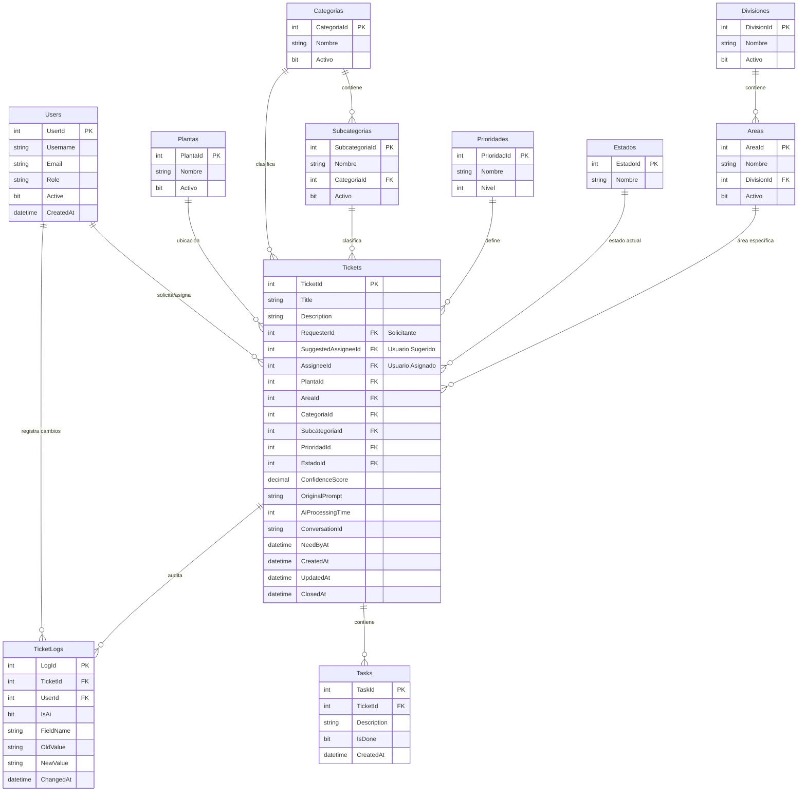
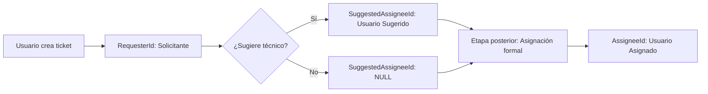
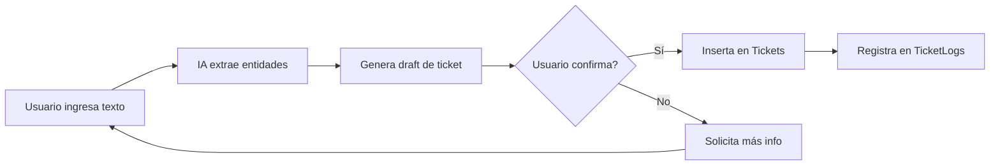

# 🗄️ Arquitectura de Base de Datos - GESTAR IA

## Descripción General

Sistema de gestión de tickets asistido por IA con arquitectura normalizada (3NF) diseñada para SQL Server/Azure SQL y SQLite. La base de datos soporta clasificación automática mediante IA, auditoría completa y gestión jerárquica de ubicaciones y categorías.

---

## 📊 Diagrama de Relaciones



---

## 📋 Tablas Maestras (Lookups)

### 🏭 Plantas
Ubicaciones físicas de la organización.

| Campo | Tipo | Descripción |
|-------|------|-------------|
| **PlantaId** | INT (PK) | Identificador único |
| Nombre | NVARCHAR(100) | Nombre de la planta (único) |
| Activo | BIT | Estado activo/inactivo |

**Datos Iniciales:**
- Planta 1
- Planta 2

---

### 🏢 Divisiones
Divisiones organizacionales principales.

| Campo | Tipo | Descripción |
|-------|------|-------------|
| **DivisionId** | INT (PK) | Identificador único |
| Nombre | NVARCHAR(100) | Nombre de la división (único) |
| Activo | BIT | Estado activo/inactivo |

**Datos Iniciales:**
- Sellado
- Forja
- Distribución

---

### 📍 Areas
Áreas específicas dentro de cada división.

| Campo | Tipo | Descripción |
|-------|------|-------------|
| **AreaId** | INT (PK) | Identificador único |
| Nombre | NVARCHAR(100) | Nombre del área |
| DivisionId | INT (FK) | División a la que pertenece |
| Activo | BIT | Estado activo/inactivo |

**Relación:** `Areas.DivisionId → Divisiones.DivisionId`

**Ejemplo:**
- Línea de Prensa 1 (División: Forja)

---

### 🏷️ Categorias
Categorías principales de tickets.

| Campo | Tipo | Descripción |
|-------|------|-------------|
| **CategoriaId** | INT (PK) | Identificador único |
| Nombre | NVARCHAR(100) | Nombre de la categoría (único) |
| Activo | BIT | Estado activo/inactivo |

**Datos Iniciales:**
- Mantenimiento
- IT
- Producción

---

### 🔖 Subcategorias
Subcategorías específicas de cada categoría.

| Campo | Tipo | Descripción |
|-------|------|-------------|
| **SubcategoriaId** | INT (PK) | Identificador único |
| Nombre | NVARCHAR(100) | Nombre de la subcategoría |
| CategoriaId | INT (FK) | Categoría a la que pertenece |
| Activo | BIT | Estado activo/inactivo |

**Relación:** `Subcategorias.CategoriaId → Categorias.CategoriaId`

**Ejemplo:**
- Falla Eléctrica (Categoría: Mantenimiento)

---

### ⚡ Prioridades
Niveles de prioridad para tickets.

| Campo | Tipo | Descripción |
|-------|------|-------------|
| **PrioridadId** | INT (PK) | Identificador único |
| Nombre | NVARCHAR(50) | Nombre de la prioridad (único) |
| Nivel | INT | Nivel numérico (0=Crítica, 1=Alta, 2=Media, 3=Baja) |

**Datos Iniciales:**

| Nombre | Nivel |
|--------|-------|
| Crítica | 0 |
| Alta | 1 |
| Media | 2 |
| Baja | 3 |

---

### 📊 Estados
Estados del ciclo de vida de un ticket.

| Campo | Tipo | Descripción |
|-------|------|-------------|
| **EstadoId** | INT (PK) | Identificador único |
| Nombre | NVARCHAR(50) | Nombre del estado (único) |

**Datos Iniciales:**
- Abierto
- En Progreso
- Cerrado

---

## 👥 Entidades Principales

### 🧑‍💼 Users
Usuarios del sistema (solicitantes, técnicos, administradores).

| Campo | Tipo | Descripción |
|-------|------|-------------|
| **UserId** | INT (PK) | Identificador único |
| Username | NVARCHAR(100) | Nombre de usuario (único) |
| Email | NVARCHAR(255) | Correo electrónico (único) |
| Role | NVARCHAR(50) | Rol: Admin, Tecnico, Solicitante |
| Active | BIT | Usuario activo/inactivo |
| CreatedAt | DATETIME2 | Fecha de creación |

**Datos Iniciales:**
- juan_perez (Solicitante)
- tecnico_1 (Tecnico)

---

### 🎫 Tickets
Tabla central del sistema de tickets.

| Campo | Tipo | Descripción |
|-------|------|-------------|
| **TicketId** | INT (PK) | Identificador único |
| Title | NVARCHAR(200) | Título del ticket |
| Description | NVARCHAR(MAX) | Descripción detallada |
| **Usuarios** | | |
| RequesterId | INT (FK) | **Solicitante**: Usuario que crea el ticket |
| SuggestedAssigneeId | INT (FK) | **Usuario Sugerido**: Propuesto por el solicitante (nullable) |
| AssigneeId | INT (FK) | **Usuario Asignado**: Formalmente responsable, asignado posteriormente (nullable) |
| **Localización** | | |
| PlantaId | INT (FK) | Planta donde ocurre |
| AreaId | INT (FK) | Área específica |
| **Clasificación** | | |
| CategoriaId | INT (FK) | Categoría principal |
| SubcategoriaId | INT (FK) | Subcategoría específica |
| PrioridadId | INT (FK) | Nivel de prioridad |
| EstadoId | INT (FK) | Estado actual |
| **Metadatos IA** | | |
| ConfidenceScore | DECIMAL(5,2) | Confianza de clasificación IA (0-1) |
| OriginalPrompt | NVARCHAR(MAX) | Prompt original del usuario |
| AiProcessingTime | INT | Tiempo de procesamiento IA (ms) |
| ConversationId | TEXT | ID de conversación para seguimiento |
| NeedByAt | DATETIME2 | Fecha de necesidad: momento esperado de resolución (nullable) |
| **Fechas** | | |
| CreatedAt | DATETIME2 | Fecha de creación |
| UpdatedAt | DATETIME2 | Última actualización |
| ClosedAt | DATETIME2 | Fecha de cierre (nullable) |

**Relaciones:**
- `RequesterId → Users.UserId` (Solicitante)
- `SuggestedAssigneeId → Users.UserId` (Usuario Sugerido)
- `AssigneeId → Users.UserId` (Usuario Asignado)
- `PlantaId → Plantas.PlantaId`
- `AreaId → Areas.AreaId`
- `CategoriaId → Categorias.CategoriaId`
- `SubcategoriaId → Subcategorias.SubcategoriaId`
- `PrioridadId → Prioridades.PrioridadId`
- `EstadoId → Estados.EstadoId`

### Flujo de Asignación de Usuarios

El sistema implementa un flujo de asignación en tres etapas:



**Etapas:**

1. **Creación (RequesterId)**: El usuario que crea el ticket queda registrado como solicitante. Este campo es obligatorio y se establece automáticamente.

2. **Sugerencia (SuggestedAssigneeId)**: El solicitante puede proponer un técnico o usuario específico para resolver el ticket. Este campo es opcional (nullable).

3. **Asignación Formal (AssigneeId)**: En una etapa posterior del flujo (revisión del responsable del área, revisión por supervisor, etc.), se asigna formalmente el responsable del ticket. Este campo es opcional y se completa después de la creación.

---

### ✅ Tasks
Tareas asociadas a tickets (checklist).

| Campo | Tipo | Descripción |
|-------|------|-------------|
| **TaskId** | INT (PK) | Identificador único |
| TicketId | INT (FK) | Ticket al que pertenece |
| Description | NVARCHAR(MAX) | Descripción de la tarea |
| IsDone | BIT | Tarea completada (sí/no) |
| CreatedAt | DATETIME2 | Fecha de creación |

**Relación:** `Tasks.TicketId → Tickets.TicketId`

---

## 📝 Auditoría y Trazabilidad

### 📜 TicketLogs
Registro de cambios en tickets (auditoría completa).

| Campo | Tipo | Descripción |
|-------|------|-------------|
| **LogId** | INT (PK) | Identificador único |
| TicketId | INT (FK) | Ticket modificado |
| UserId | INT (FK) | Usuario que hizo el cambio (NULL si fue IA) |
| IsAi | BIT | Indica si el cambio fue hecho por IA |
| FieldName | NVARCHAR(100) | Campo modificado |
| OldValue | NVARCHAR(MAX) | Valor anterior |
| NewValue | NVARCHAR(MAX) | Valor nuevo |
| ChangedAt | DATETIME2 | Fecha del cambio |

**Relaciones:**
- `TicketId → Tickets.TicketId`
- `UserId → Users.UserId`

---

## 🔍 Índices de Rendimiento

Para optimizar consultas frecuentes:

```sql
CREATE INDEX IX_Tickets_Estado ON Tickets(EstadoId);
CREATE INDEX IX_Tickets_Requester ON Tickets(RequesterId);
CREATE INDEX IX_Tickets_Conversation ON Tickets(ConversationId);
```

**Propósito:**
- **IX_Tickets_Estado**: Filtrado rápido por estado (dashboards)
- **IX_Tickets_Requester**: Consultas de tickets por usuario
- **IX_Tickets_Conversation**: Seguimiento de conversaciones IA

---

## 🤖 Integración con IA

### Campos Específicos para IA

| Campo | Propósito |
|-------|-----------|
| **ConfidenceScore** | Mide la confianza de la clasificación automática (0.0 - 1.0) |
| **OriginalPrompt** | Guarda el texto original del usuario para análisis |
| **AiProcessingTime** | Métricas de rendimiento del modelo |
| **ConversationId** | Permite seguimiento de conversaciones multi-turno |

### Flujo de Procesamiento IA



---

## 🔐 Normalización y Reglas de Negocio

### Normalización 3NF
- **1NF**: Todos los campos son atómicos
- **2NF**: No hay dependencias parciales
- **3NF**: No hay dependencias transitivas

### Reglas de Integridad
1. **Usuarios**: Username y Email únicos
2. **Jerarquía**: Areas dependen de Divisiones
3. **Clasificación**: Subcategorias dependen de Categorias
4. **Auditoría**: Todos los cambios se registran en TicketLogs
5. **Soft Delete**: Uso de campo `Activo` en lugar de eliminación física

---

## 📈 Casos de Uso Principales

### 1. Creación de Ticket Asistida por IA
```sql
-- La IA extrae entidades y crea el ticket
INSERT INTO Tickets (Title, Description, RequesterId, PlantaId, AreaId, 
                     CategoriaId, SubcategoriaId, PrioridadId, EstadoId,
                     ConfidenceScore, OriginalPrompt, AiProcessingTime)
VALUES ('Motor no arranca', 'Descripción...', 1, 1, 1, 1, 1, 2, 1, 0.95, 
        'El motor de la prensa no arranca', 150);
```

### 2. Consulta de Tickets Abiertos por Planta
```sql
SELECT t.TicketId, t.Title, p.Nombre AS Planta, pr.Nombre AS Prioridad
FROM Tickets t
JOIN Plantas p ON t.PlantaId = p.PlantaId
JOIN Prioridades pr ON t.PrioridadId = pr.PrioridadId
JOIN Estados e ON t.EstadoId = e.EstadoId
WHERE e.Nombre = 'Abierto'
ORDER BY pr.Nivel, t.CreatedAt;
```

### 3. Auditoría de Cambios
```sql
SELECT tl.ChangedAt, u.Username, tl.FieldName, tl.OldValue, tl.NewValue, tl.IsAi
FROM TicketLogs tl
LEFT JOIN Users u ON tl.UserId = u.UserId
WHERE tl.TicketId = 123
ORDER BY tl.ChangedAt DESC;
```

---

## 🛠️ Compatibilidad

### SQL Server / Azure SQL
- Tipos de datos: `NVARCHAR`, `DATETIME2`, `BIT`
- Identidad: `IDENTITY(1,1)`
- Funciones: `GETDATE()`

### SQLite (Implementación Actual)
- Tipos adaptados: `TEXT`, `INTEGER`, `REAL`
- Auto-incremento: `AUTOINCREMENT`
- Funciones: `CURRENT_TIMESTAMP`

**Nota**: El código en [`app.py`](file:///c:/Users/GAUTOP/OneDrive%20-%20TARANTO%20SAN%20JUAN%20SA/Documentos/PROYECTOS%20APP/gestar-ia/app.py) usa SQLite con adaptaciones del esquema original.

---

## 📚 Archivos Relacionados

- [`database_schema.sql`](file:///c:/Users/GAUTOP/OneDrive%20-%20TARANTO%20SAN%20JUAN%20SA/Documentos/PROYECTOS%20APP/gestar-ia/database_schema.sql) - Esquema SQL Server completo
- [`app.py`](file:///c:/Users/GAUTOP/OneDrive%20-%20TARANTO%20SAN%20JUAN%20SA/Documentos/PROYECTOS%20APP/gestar-ia/app.py) - Implementación SQLite en Python
- `tickets_mvp.db` - Base de datos SQLite activa
